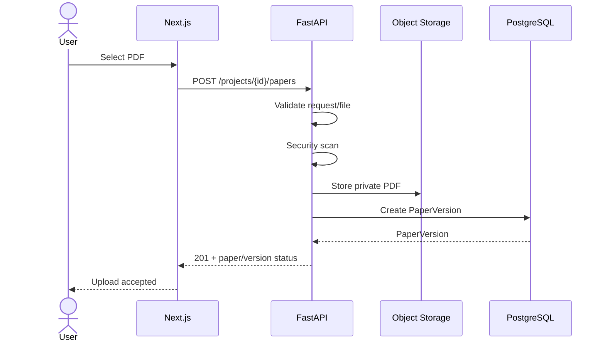
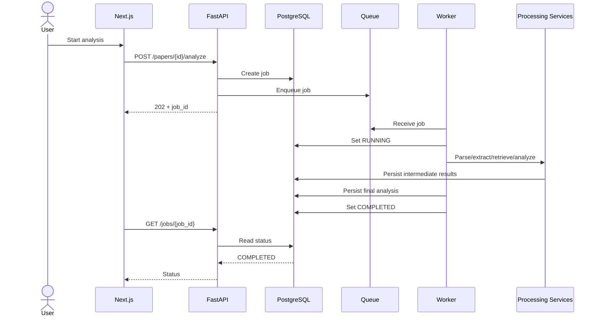
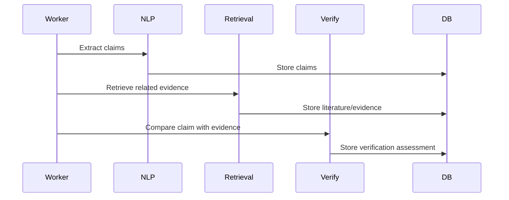
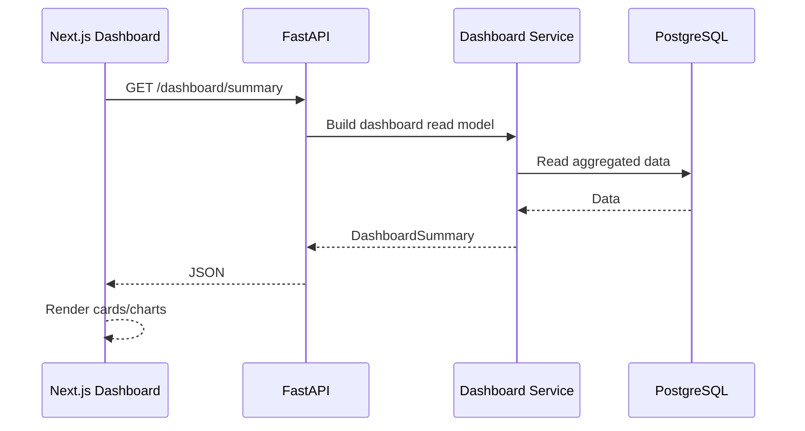
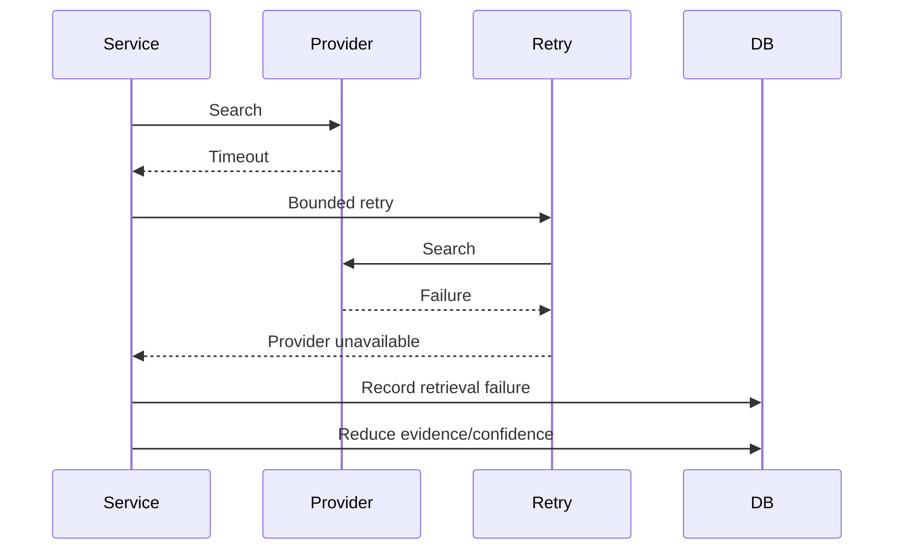

# Genesis-AI — Phase 3 System Architecture

## Document Status

- Project: Genesis-AI Research Intelligence Platform
- Blueprint Phase: 3 — System Architecture
- Status: Revised draft for review
- Source of truth: `docs/phase-0-blueprint.pdf`
- Requirements baseline: `docs/requirements/phase-2-requirements.md`
- Previous checkpoint: Phase 2 requirements commit `7c42ea9`
- Architecture philosophy: modular, evidence-grounded, deployable, observable, and deliberately simple

---

# 1. Purpose

This document converts the approved Phase 2 requirements into a concrete
technical architecture that can guide implementation.

The architecture supports the Genesis-AI workflow:

Research Paper
→ Document Processing
→ Research Information Extraction
→ Scholarly Retrieval
→ Evidence Retrieval
→ Claim/Citation Verification
→ Novelty & Research-Gap Analysis
→ Quality Evaluation
→ Recommendations
→ Researcher Decision Support

Genesis-AI remains a research decision-support system. It does not claim
to determine scientific truth, absolute novelty, publication acceptance,
plagiarism, or research validity.

---

# 2. Architecture Principles

## P1 — Evidence before conclusion

Important conclusions must be based on available evidence.

```text
Source
  ↓
Retrieval
  ↓
Evidence
  ↓
Analysis
  ↓
Conclusion
```

## P2 — Separation of concerns

The system is divided into explicit layers:

```text
Client
  ↓
API
  ↓
Application
  ↓
Domain/Capability Services
  ↓
ML / Retrieval
  ↓
Data
  ↓
Infrastructure
  ↓
Observability
```

## P3 — Asynchronous expensive work

Document parsing, OCR, extraction, retrieval, verification, evaluation,
and recommendation generation are background operations.

## P4 — Traceability

Important assessments expose:

- score
- evidence
- reasoning
- sources
- confidence
- limitations

## P5 — Graceful degradation

Provider failure, weak retrieval, incomplete extraction, or insufficient
evidence must reduce capability/confidence rather than cause fabricated
results.

## P6 — Provider abstraction

External scholarly and model providers are accessed through internal
interfaces/adapters.

## P7 — MVP simplicity

The MVP does not introduce:

- Kubernetes
- microservice-per-feature deployment
- dedicated vector database
- unnecessary multiple databases
- custom foundation-model training

## P8 — Untrusted documents

Uploaded papers and extracted document text are untrusted data. Document
content must never override trusted system instructions.

## P9 — Deployment-aware design

The architecture supports deployment from the beginning while scaling
only when demonstrated need justifies it.

---

# 3. System Context

```text
                         RESEARCHER
                             |
                             v
                  +----------------------+
                  | Next.js Web Client   |
                  +----------+-----------+
                             |
                           HTTPS
                             |
                             v
                  +----------------------+
                  | FastAPI API          |
                  | Auth / Validation    |
                  | Authorization        |
                  | Orchestration        |
                  +----------+-----------+
                             |
             +---------------+----------------+
             |               |                |
             v               v                v
       PostgreSQL       Object Storage      Queue
       + pgvector                            |
                                             v
                                      Background Worker
                                             |
                          +------------------+------------------+
                          |          |          |              |
                          v          v          v              v
                    Document/NLP Retrieval Verification   Evaluation
                          |          |          |              |
                          +----------+----------+--------------+
                                             |
                                             v
                                         ML / LLM
                                             |
                                             v
                                    External Providers
```

---

# 4. Component Architecture

## 4.1 Next.js Web Application

Responsibilities:

- authentication interface
- project workspace
- paper upload
- job status
- analysis report
- evidence exploration
- research discovery
- research landscape
- research gaps
- research positioning
- recommendations
- dashboard

The frontend does not directly access the database or perform authoritative
research analysis.

### Dashboard architecture

The dashboard is a research-workflow surface, not a decorative analytics
page.

It should eventually expose backend-backed data such as:

```text
Research Overview
├── Active projects
├── Papers analyzed
├── Claims analyzed
├── Citations checked
├── Evaluation/quality overview
│
├── Analysis trends
├── Research areas
├── Claim/evidence status
├── Citation status
│
├── Recent projects
├── Recent papers
│
├── Research gaps
├── Novelty / positioning
└── Recommendations
```

The visual direction is:

- minimal
- professional
- research-oriented
- information-dense but readable
- creative without becoming cartoonish

No dashboard metric should be presented as real unless it is backed by
actual application data.

---

## 4.2 FastAPI API

Responsibilities:

- HTTP routing
- authentication
- authorization
- request validation
- response serialization
- API versioning
- resource access control
- job creation
- status retrieval
- report retrieval

Base path:

```text
/api/v1
```

The API does not contain model algorithms or large processing workflows.

---

## 4.3 Application Services

Application services coordinate workflows.

Examples:

```text
ProjectApplicationService
PaperApplicationService
AnalysisApplicationService
LiteratureApplicationService
DashboardApplicationService
```

They coordinate capability services and persistence but do not duplicate
domain algorithms.

---

## 4.4 Capability Services

Repository capability boundaries:

```text
services/
├── document-processing/
├── retrieval/
├── nlp/
├── citation-analysis/
├── claim-verification/
├── novelty-analysis/
├── evaluation/
└── recommendation/
```

These are modular Python packages in the MVP, not independently deployed
microservices.

### document-processing

Owns:

- PDF validation integration
- parsing
- OCR fallback
- structure detection
- document chunks
- extraction metadata

### nlp

Owns:

- research information extraction
- claim extraction
- method/dataset/result extraction
- NLP preprocessing

### retrieval

Owns:

- provider adapters
- literature discovery
- candidate retrieval
- evidence retrieval
- retrieval provenance

### citation-analysis

Owns:

- citation occurrence processing
- citation context
- cited-work matching
- citation relevance signals

### claim-verification

Owns:

- claim/evidence comparison
- support status
- contradiction signals
- insufficient-evidence determination

### novelty-analysis

Owns:

- similarity signals
- prior-work comparison
- relative novelty signals
- candidate research-gap signals

### evaluation

Owns:

- evaluation dimensions
- score aggregation
- confidence computation
- assessment construction

#### Score aggregation contract

The evaluation layer produces dimension-level scores from validated,
evidence-backed upstream signals.

The scoring pipeline is:

Measured upstream signals
        ↓
Signal validation
        ↓
Signal normalization
        ↓
Weighted aggregation
        ↓
Dimension score
        ↓
Confidence computation
        ↓
Assessment construction

All dimension scores use a normalized range of **0–100**.

A score of 0 represents the weakest measurable result supported by the
configured scoring signals, while 100 represents the strongest measurable
result supported by those signals.

A score is not a probability of scientific correctness and must not be
presented as an absolute judgment of research quality.

Each evaluation dimension defines measurable upstream signals. Examples
include evidence support rate, citation coverage, citation-context
similarity, methodological completeness, baseline coverage,
experimental comparison coverage, reproducibility signals, retrieval
coverage, and semantic similarity to retrieved prior work.

Before aggregation, every signal must be validated and normalized to a
compatible scoring range.

Unavailable or insufficient signals must not be silently replaced with
fabricated values. The scoring configuration must explicitly define
whether a missing signal is optional and excluded from aggregation or
whether its absence makes the dimension insufficiently supported.

The initial aggregation mechanism is deterministic weighted aggregation:

dimension_score =
    Σ(signal_i × weight_i) / Σ(weight_i)

Signal weights must be explicitly defined by the scoring configuration.
Weights must not be dynamically invented by an LLM.

The scoring configuration must be versioned. The configuration version
must identify the signal definitions, normalization rules, aggregation
weights, and scoring logic used to produce an assessment.

Every dimension assessment must retain:

- score
- contributing signals
- evidence references
- reasoning
- confidence
- limitations
- scoring configuration version

Confidence is computed separately from the score. Confidence reflects
evidence availability, evidence quality, retrieval strength, extraction
confidence, signal agreement, and information completeness.

Weak evidence coverage or retrieval quality must reduce confidence rather
than artificially changing the underlying dimension score.

The LLM may interpret validated signals, summarize evidence, generate
reasoning, and identify limitations. The LLM must not independently
invent numeric signals, signal weights, final dimension scores, or
evidence that was not retrieved or extracted.

The final numeric score must always be produced by the deterministic
scoring layer from configured and validated signals.

Changes to signal definitions, normalization rules, aggregation weights,
or scoring logic must create a new scoring configuration version.
Previously generated assessments must remain reproducible against the
configuration version under which they were created.

### recommendation

Owns:

- recommendation generation
- prioritization
- evidence linkage
- limitation reporting

---
#### Recommendation contract

The recommendation layer converts evidence-backed assessments and flagged
issues into actionable research-improvement recommendations.

The recommendation pipeline is:

Assessment results
        ↓
Flagged weaknesses / issues
        ↓
Evidence and provenance lookup
        ↓
Recommendation prioritization
        ↓
Template-guided recommendation generation
        ↓
Evidence and limitation attachment
        ↓
Persisted recommendation

Each recommendation must be associated with the analysis that produced it
and must identify the assessment, issue, or evidence that motivated the
recommendation where applicable.

A recommendation should contain, at minimum:

- id
- analysis_id
- title
- description
- priority
- category
- rationale
- evidence references
- limitations
- created_at

Recommendations must be actionable rather than merely restating an
assessment.

Priority must be derived from configured factors such as:

- severity of the identified weakness
- confidence in the supporting evidence
- potential research impact
- feasibility where measurable

The prioritization rules must be deterministic and explicitly configured.
The LLM must not independently assign arbitrary priority values.

Recommendations must remain grounded in available evidence. If evidence
is insufficient to support a recommendation, the system must either
withhold the recommendation or explicitly mark it as low-confidence and
state the limitation.

The LLM may be used to:

- formulate recommendation text
- summarize the underlying issue
- explain the rationale
- improve readability

The LLM must not invent:

- supporting evidence
- research findings
- assessment scores
- priority rules
- unsupported factual claims

Every recommendation must retain links to the evidence and assessment
records that support it.

Recommendation generation is asynchronous as part of the analysis
pipeline.

Generated recommendations must be persisted so that the report and
dashboard read models use the same authoritative recommendation records.

Changes to recommendation-generation rules, prioritization logic, or
templates must be versioned where they can affect reproducibility of
previous analyses.

# 5. ML Architecture

```text
ml/
├── models/
├── training/
├── inference/
├── evaluation/
└── experiments/
```

Responsibilities:

- model definitions
- model loading
- inference
- embeddings
- ML preprocessing/postprocessing
- training experiments where justified
- ML evaluation

Initial model direction remains compatible with:

- PyTorch
- Transformers
- sentence-transformers

Model-specific code must not leak into FastAPI routes.

---

# 6. Retrieval Architecture

Retrieval uses an internal abstraction.

```text
                 Retrieval Interface
                         |
       +-----------------+------------------+
       |                 |                  |
    OpenAlex       Semantic Scholar       Crossref
       |                 |                  |
       +-----------------+------------------+
                         |
                       arXiv
```

## 6.1 Normalized provider contract

Conceptual interface:

```python
search(query, filters)
get_work(identifier)
get_citations(identifier)
get_references(identifier)
get_full_text_or_link(identifier)
```

Provider adapters normalize:

```text
provider
provider_id
title
authors
abstract
publication_date
venue
doi / identifier
links
availability
citation_metadata
```

The internal retrieval layer must not expose provider-specific response
structures to the rest of the application.

## 6.2 Retrieval run

Every retrieval operation should be associated with a retrieval run:

```text
RetrievalRun
├── id
├── project_id / analysis_id
├── query
├── filters
├── providers_used
├── started_at
├── completed_at
├── status
└── error information
```

This permits later reproducibility and provenance analysis.

---

# 7. Evidence Architecture

Evidence is a first-class domain object.

```text
Evidence
├── id
├── source_type
├── source_identifier
├── literature_item_id
├── paper_version_id
├── location
├── text_span
├── retrieval_run_id
├── relevance_score
├── extraction_confidence
└── created_at
```

An assessment references evidence rather than embedding unsupported claims
inside free-form generated text.

```text
Assessment
├── dimension
├── score
├── reasoning
├── confidence
├── limitations[]
└── evidence[]
```

Evidence provenance must survive from retrieval through final report
generation.

---

# 8. Database Architecture

Primary database:

```text
PostgreSQL
```

Vector extension:

```text
pgvector
```

Object storage:

```text
Private object/file storage
```

## 8.1 Core relational model

```text
users
  1
  |
  N
projects
  1
  |
  +--------------------+
  |                    |
  N                    N
papers             literature_items
  |
  N
paper_versions
  |
  +------------------+
  |                  |
  N                  N
claims            citations

paper_versions
  |
  N
processing_jobs

paper_versions
  |
  N
analyses
  |
  N
assessments
  |
  N
assessment_evidence
  |
  N
evidence

analyses
  |
  N
recommendations

retrieval_runs
  |
  N
evidence
```

## 8.2 Entity requirements

### users

Primary key:

```text
id
```

Stores identity and account metadata.

### projects

Primary key:

```text
id
```

Foreign key:

```text
owner_user_id → users.id
```

Important indexes:

```text
(owner_user_id)
```

created_at
updated_at

### papers

Primary key:

```text
id
```

Foreign key:

```text
project_id → projects.id
```

created_at
updated_at

### paper_versions

Primary key:

```text
id
```

Foreign key:

```text
paper_id → papers.id
```

Important fields:

```text
version_number
storage_key
file_hash
file_size
mime_type
processing_status
created_at
updated_at
```

Recommended uniqueness:

```text
(paper_id, version_number)
```

### processing_jobs

Primary key:

```text
id
```

Foreign key:

```text
paper_version_id → paper_versions.id
```

Important fields:

```text
job_type
status
stage
attempts
max_attempts
idempotency_key
pipeline_version
error_code
error_message
created_at
updated_at
started_at
completed_at
```

Important index:

```text
(status, created_at)
```

### literature_items

Primary key:

```text
id
```

Provider identifiers should be unique within provider scope:

```text
(provider, provider_id)
```

### claims

Primary key:

```text
id
```

Foreign key:

```text
paper_version_id → paper_versions.id
```

Stores text/span location and extraction metadata.

### citations

Primary key:

```text
id
```

Foreign keys:

```text
paper_version_id → paper_versions.id
literature_item_id → literature_items.id
```

### analyses

Primary key:

```text
id
```

Foreign key:

```text
paper_version_id → paper_versions.id
```

Important fields:

```text
status
pipeline_version
created_at
started_at
completed_at
```

### assessments

Primary key:

```text
id
```

Foreign key:

```text
analysis_id → analyses.id
```

Important uniqueness:

```text
(analysis_id, dimension)
```

### evidence

Primary key:

```text
id
```

Foreign keys may reference:

```text
literature_items.id
paper_versions.id
retrieval_runs.id
```

### assessment_evidence

Join table:

```text
assessment_id → assessments.id
evidence_id   → evidence.id
```

Uniqueness:

```text
(assessment_id, evidence_id)
```

### recommendations

Primary key:

```text
id
```

Foreign key:

```text
analysis_id → analyses.id
```

### retrieval_runs

Primary key:

```text
id
```

Foreign key:

```text
analysis_id → analyses.id
```

---

# 9. Vector Architecture

pgvector stores embeddings associated with searchable domain objects.

Candidate vector-bearing records:

```text
paper chunks
literature chunks
claims
evidence passages
```

Vectors must retain their source identity.

```text
Embedding
├── source_type
├── source_id
├── model_name
├── model_version
├── vector
└── created_at
```

Changing the embedding model must not silently invalidate old vectors.

---


## 8.3 Database Integrity and Ownership Contract

The relational database is the authoritative system of record for
application state, ownership, processing state, analysis state, and
research provenance.

Object storage is authoritative for uploaded binary files.
pgvector is authoritative only for stored vector representations;
relational metadata remains authoritative for vector ownership and
provenance.

### 8.3.1 Ownership boundary

Every user-owned resource must be reachable through an ownership chain:

user
  ↓
project
  ↓
paper
  ↓
paper_version
  ↓
processing_job / claim / citation / analysis

The API must authorize access using this ownership chain before
returning or mutating a resource.

A resource must never be authorized solely because the caller knows
its database identifier.

### 8.3.2 Cardinality

The intended relationships are:

- One user may own many projects.
- One project belongs to exactly one owner.
- One project may contain many papers.
- One paper belongs to exactly one project.
- One paper may contain many paper versions.
- One paper version belongs to exactly one paper.
- One paper version may have many processing jobs.
- One paper version may have many claims.
- One paper version may have many citations.
- One paper version may have many analyses.
- One analysis may contain many assessments.
- One assessment may reference many evidence records.
- One evidence record may support many assessments.
- One analysis may have many recommendations.
- One analysis may have many retrieval runs.
- One retrieval run may produce many evidence records.

### 8.3.3 Foreign-key behavior

Foreign keys must enforce domain ownership and referential integrity.

Default behavior:

- Child records must not exist without their parent.
- Deletion of user-owned resources should be performed through
  explicit application-level lifecycle operations.
- Cascading deletion must not be used indiscriminately for
  research evidence or provenance records.
- File deletion from object storage must be coordinated with the
  corresponding database lifecycle.
- Any destructive cascade must be explicitly documented in the
  migration/schema definition.

### 8.3.4 Required timestamps

Persistent operational entities should use:

- created_at
- updated_at

where mutation tracking is relevant.

Persistent mutable entities must use:

- created_at
- updated_at

Processing entities must additionally use:

- started_at
- completed_at

when applicable.

For entities whose state can change after creation, `updated_at` must be
updated whenever the persistent record is materially modified.

All timestamps must be stored as timezone-aware timestamps.

### 8.3.5 Uniqueness requirements

The following logical uniqueness constraints apply:

- projects: no global name uniqueness requirement
- paper_versions: `(paper_id, version_number)`
- literature_items: `(provider, provider_id)`
- assessments: `(analysis_id, dimension)`
- assessment_evidence: `(assessment_id, evidence_id)`

Processing jobs must support an application-defined idempotency
boundary so that retrying the same logical operation does not
silently create duplicate active work.

### 8.3.6 Processing status

Processing state must be represented explicitly rather than inferred
from timestamps or nullable fields.

Example lifecycle:

QUEUED
  ↓
RUNNING
  ↓
SUCCEEDED

Failure path:

RUNNING
  ↓
FAILED
  ↓
RETRYING
  ↓
RUNNING

Terminal states must be explicitly distinguishable from transient
states.

### 8.3.7 Analysis status

Analysis records must independently represent analysis lifecycle.

Example:

QUEUED
  ↓
RUNNING
  ↓
COMPLETED

Failure:

RUNNING
  ↓
FAILED

An analysis must reference the exact paper_version and pipeline_version
used to produce it.

### 8.3.8 Provenance requirements

Research-derived records must retain sufficient identifiers to trace
their origin.

At minimum, provenance must be recoverable through:

- paper_version_id
- literature_item_id where applicable
- retrieval_run_id where applicable
- source identifier
- source location/span where applicable
- pipeline/model version where applicable

No final assessment should depend on evidence that cannot be traced
back to its originating source or document location.

### 8.3.9 Vector integrity

Every embedding record must identify:

- source_type
- source_id
- model_name
- model_version
- vector
- created_at

Embedding uniqueness should prevent duplicate representations of the
same source under the same model/version unless versioned replacement
is explicitly required.

Similarity searches must operate only against compatible embedding
dimensions and model/version combinations.

The relational metadata remains authoritative for identifying what an
embedding represents.

### 8.3.10 Indexing requirements

Indexes must support the primary application access paths.

Required categories include:

- project ownership
- paper → project
- paper version → paper
- processing job status and creation time
- analysis → paper version
- assessment → analysis
- evidence → retrieval run
- literature provider/provider_id
- embedding source identity
- embedding model/version

Indexes must be added based on measured query patterns as the system
evolves; unnecessary indexes should be avoided.

### 8.3.11 Migration ownership

Database schema changes must be version-controlled.

The schema must not depend on manually editing a production database.

Schema evolution must use an explicit migration mechanism with:

- ordered migrations
- forward application
- migration history
- rollback strategy where practical
- CI validation

The initial development database may use initialization SQL, but
production schema evolution must be migration-driven.

### 8.3.12 Database as system of record

The following boundaries are authoritative:

| Data | Authority |
|---|---|
| User/project/paper metadata | PostgreSQL |
| Processing/analysis state | PostgreSQL |
| Claims/citations | PostgreSQL |
| Retrieval provenance | PostgreSQL |
| Evidence metadata | PostgreSQL |
| Uploaded PDF bytes | Object storage |
| Derived document artifacts | Object storage where applicable |
| Embedding vectors | PostgreSQL + pgvector |
| Embedding ownership/provenance | PostgreSQL |

The system must not treat object-storage filenames, vector records,
or generated frontend state as authoritative domain state.

# 10. Object Storage Architecture

Uploaded papers are stored outside PostgreSQL.

Conceptual key:

```text
users/{user_id}/projects/{project_id}/papers/{paper_id}/versions/{version_id}/original.pdf
```

Derived artifacts may use a separate namespace.

Files are private by default.

The API authorizes access before generating or serving controlled file access.

---

# 11. API Contracts

## 11.1 Standard error envelope

```json
{
  "error": {
    "code": "RESOURCE_NOT_FOUND",
    "message": "Paper was not found.",
    "request_id": "..."
  }
}
```

Every API error should provide a stable machine-readable code.

## 11.2 Project creation

```text
POST /api/v1/projects
```

Request:

```json
{
  "name": "Research Project",
  "description": "Optional description"
}
```

Response:

```json
{
  "id": "...",
  "name": "Research Project",
  "description": "...",
  "created_at": "..."
}
```

Possible statuses:

```text
201 Created
400 Bad Request
401 Unauthorized
422 Validation Error
```

## 11.3 Project retrieval

```text
GET /api/v1/projects/{project_id}
```

Authorization:

- authenticated user
- user must own or have access to project

Possible statuses:

```text
200 OK
401 Unauthorized
403 Forbidden
404 Not Found
```

## 11.4 Paper upload

```text
POST /api/v1/projects/{project_id}/papers
Content-Type: multipart/form-data
```

Input:

```text
file
```

Response:

```json
{
  "paper_id": "...",
  "paper_version_id": "...",
  "status": "VALIDATING"
}
```

Possible statuses:

```text
201 Created
400 Bad Request
401 Unauthorized
403 Forbidden
413 Payload Too Large
415 Unsupported Media Type
422 Validation Error
```

## 11.5 Start analysis

```text
POST /api/v1/papers/{paper_id}/analyze
```

Response:

```json
{
  "job_id": "...",
  "status": "QUEUED"
}
```

Possible statuses:

```text
202 Accepted
400 Bad Request
401 Unauthorized
403 Forbidden
404 Not Found
409 Conflict
```

`409 Conflict` is used when an equivalent active analysis already exists.

## 11.6 Job status

```text
GET /api/v1/jobs/{job_id}
```

Response:

```json
{
  "job_id": "...",
  "status": "RUNNING",
  "stage": "RETRIEVING",
  "attempts": 1,
  "created_at": "...",
  "started_at": "..."
}
```

## 11.7 Analysis report

```text
GET /api/v1/analyses/{analysis_id}
```

Response concept:

```json
{
  "analysis_id": "...",
  "status": "COMPLETED",
  "paper_id": "...",
  "assessments": [],
  "recommendations": [],
  "summary": {}
}
```

## 11.8 Assessment evidence

```text
GET /api/v1/analyses/{analysis_id}/evidence
```

Returns evidence objects with provenance.

## 11.9 Dashboard

```text
GET /api/v1/dashboard/summary
GET /api/v1/dashboard/trends
GET /api/v1/dashboard/recent-projects
GET /api/v1/dashboard/recent-papers
```

These endpoints return backend-generated read models.

---

## 11.10 API Versioning

All externally exposed application endpoints use an explicit major
version prefix:

    /api/v1/...

The API version represents the public contract, not the internal
implementation version.

Backward-incompatible request, response, or semantic changes require
a new major API version.

Internal service interfaces may evolve independently of the public API
version.

The frontend must use the versioned API contract rather than relying
on unversioned endpoints.

## 11.11 Request Correlation

Every API request receives a request identifier.

The identifier may be supplied by the client through:

    X-Request-ID

If absent, the API generates a new request identifier.

The request identifier must be:

- available to application services
- included in structured logs
- associated with relevant errors
- returned in API error responses

Example:

    X-Request-ID: 7f7f2c3d-...

The request identifier is for observability and troubleshooting.
It is not an authorization credential.

## 11.12 Standard Success Responses

Successful API responses should use resource-specific JSON objects
rather than wrapping every response in an unnecessary generic envelope.

Examples:

    201 Created
    {
      "id": "...",
      "name": "Research Project",
      "created_at": "..."
    }

    202 Accepted
    {
      "job_id": "...",
      "status": "QUEUED"
    }

    200 OK
    {
      "id": "...",
      "status": "COMPLETED"
    }

A `204 No Content` response may be used for successful operations
that intentionally return no representation.

The API must not return fabricated or placeholder analytical data.

## 11.13 Standard Error Contract

All expected API errors use:

    {
      "error": {
        "code": "RESOURCE_NOT_FOUND",
        "message": "Paper was not found.",
        "request_id": "..."
      }
    }

Requirements:

- `code` is stable and machine-readable.
- `message` is safe for client display/logging.
- `request_id` is present for correlation.
- Internal stack traces are never exposed.
- Database credentials, provider credentials, filesystem paths,
  prompts, and other secrets are never exposed.
- Error messages must not disclose resources belonging to another
  unauthorized user.

Validation errors may additionally include structured field details:

    {
      "error": {
        "code": "VALIDATION_ERROR",
        "message": "Request validation failed.",
        "request_id": "...",
        "details": {
          "field": "name",
          "reason": "must not be empty"
        }
      }
    }

## 11.14 HTTP Status Semantics

The following status-code semantics apply across the API:

    200 OK
        Successful retrieval or synchronous operation.

    201 Created
        A new persistent resource was successfully created.

    202 Accepted
        A background operation was accepted and queued.

    204 No Content
        Successful operation with intentionally empty response body.

    400 Bad Request
        Request is syntactically valid but violates an application
        request rule that is not better represented by another status.

    401 Unauthorized
        Authentication is missing or invalid.

    403 Forbidden
        Authentication succeeded but the authenticated user does not
        have permission to access the resource.

    404 Not Found
        Requested resource does not exist or is intentionally hidden
        by the authorization policy.

    409 Conflict
        Request conflicts with current resource state, including
        duplicate active operations.

    413 Payload Too Large
        Uploaded payload exceeds the configured limit.

    415 Unsupported Media Type
        Uploaded content type is unsupported.

    422 Unprocessable Content
        Request structure or field validation failed.

    429 Too Many Requests
        Rate limit has been exceeded.

    500 Internal Server Error
        Unexpected server-side failure.

    502 Bad Gateway
        Upstream provider returned an invalid/unusable response.

    503 Service Unavailable
        Required upstream or infrastructure dependency is temporarily
        unavailable.

The implementation must use the most specific applicable status code.

## 11.15 Authentication Requirement

All private application resources require an authenticated user.

Public health/readiness endpoints may be explicitly exempted.

Authentication is evaluated before resource authorization.

Conceptually:

    Request
      ↓
    Authenticate
      ↓
    Resolve resource
      ↓
    Authorize
      ↓
    Execute operation

The API must not rely on frontend authentication state as proof of
authorization.

## 11.16 Authorization Requirement

Authorization must be enforced server-side for every user-owned
resource.

Examples:

    GET /api/v1/projects/{project_id}
    POST /api/v1/projects/{project_id}/papers
    POST /api/v1/papers/{paper_id}/analyze
    GET /api/v1/analyses/{analysis_id}

The API resolves the resource and verifies that the authenticated user
owns or has explicit access to the corresponding project.

Knowledge of a resource identifier alone must never grant access.

Authorization failures must not reveal sensitive information about
resources owned by another user.

## 11.17 Idempotency

Operations that create expensive or externally visible side effects
must define an idempotency boundary.

The following operations require idempotency consideration:

- paper upload
- analysis creation
- background job creation
- provider-triggering operations

Where an idempotency key is appropriate, clients may provide:

    Idempotency-Key: <opaque-client-generated-key>

The server associates the key with the authenticated user and
operation scope.

Repeated requests with the same valid key must not create uncontrolled
duplicate operations.

The server must reject reuse of an idempotency key with materially
different request parameters.

For analysis requests, the application must additionally prevent
multiple equivalent active analyses for the same paper version and
analysis configuration.

Idempotency records must not cross user ownership boundaries.

## 11.18 Paper Upload Contract

Endpoint:

    POST /api/v1/projects/{project_id}/papers

Content type:

    multipart/form-data

Required input:

    file

Optional metadata may be introduced later through explicitly versioned
request fields.

Processing sequence:

    Authenticate
      ↓
    Authorize project
      ↓
    Validate multipart request
      ↓
    Validate file type and size
      ↓
    Security scanning
      ↓
    Persist private file
      ↓
    Create PaperVersion
      ↓
    Return resource state

Successful response:

    201 Created

    {
      "paper_id": "...",
      "paper_version_id": "...",
      "status": "VALIDATING"
    }

The response must identify the created persistent resource.

The API must not report successful persistence before the required
database and storage operations have reached their defined consistency
boundary.

## 11.19 Analysis Creation Contract

Endpoint:

    POST /api/v1/papers/{paper_id}/analyze

The endpoint creates or reuses an appropriate background analysis job.

Analysis configuration:

The analysis request may include an explicit versioned analysis configuration.
If omitted, the server applies the current default configuration.

The effective configuration must be persisted with the analysis/job
identity so that equivalent requests can be detected deterministically.

At minimum, the effective configuration must identify:

- analysis configuration version
- pipeline version
- any user-selectable analysis options that materially affect results

Changing a material analysis configuration must produce a distinct logical
analysis identity and must not silently reuse results generated under a
different configuration.

Successful response:

    202 Accepted

    {
      "job_id": "...",
      "status": "QUEUED"
    }

Equivalent active analysis requests must not create uncontrolled
duplicate jobs.

If an equivalent active analysis already exists:

    409 Conflict

with:

    DUPLICATE_OPERATION

or an equivalent stable error code defined by the implementation.

The API must not perform expensive parsing, retrieval, model inference,
or evaluation synchronously inside the HTTP request.

## 11.20 Job Status Contract

Endpoint:

    GET /api/v1/jobs/{job_id}

Example:

    {
      "job_id": "...",
      "job_type": "PAPER_ANALYSIS",
      "status": "RUNNING",
      "stage": "RETRIEVING",
      "attempts": 1,
      "created_at": "...",
      "started_at": "...",
      "completed_at": null,
      "error": null
    }

For failed jobs:

    {
      "status": "FAILED",
      "error": {
        "code": "PROVIDER_UNAVAILABLE",
        "message": "A required scholarly provider was unavailable."
      }
    }

Job responses must not expose internal stack traces.

## 11.21 Analysis Report Contract

Endpoint:

    GET /api/v1/analyses/{analysis_id}

The response must identify:

- analysis
- paper/version
- analysis status
- pipeline version
- assessments
- evidence references
- recommendations
- summary
- confidence/limitations where applicable

Example:

    {
      "analysis_id": "...",
      "paper_id": "...",
      "paper_version_id": "...",
      "status": "COMPLETED",
      "pipeline_version": "...",
      "assessments": [],
      "recommendations": [],
      "summary": {},
      "limitations": []
    }

Analytical results must retain links to evidence and provenance.

The API must not represent incomplete analysis as a completed
scientific conclusion.

## 11.22 Pagination Contract

Collection endpoints must use explicit pagination.

Examples include:

    GET /api/v1/projects
    GET /api/v1/projects/{project_id}/papers
    GET /api/v1/analyses/{analysis_id}/evidence
    GET /api/v1/projects/{project_id}/literature

Initial contract:

    ?limit=20&offset=0

Requirements:

- `limit` has a server-defined maximum.
- Negative values are rejected.
- Excessive limits are capped or rejected.
- Results use deterministic ordering.
- Pagination must not bypass authorization filters.

Example response:

    {
      "items": [],
      "pagination": {
        "limit": 20,
        "offset": 0,
        "total": 0
      }
    }

Cursor-based pagination may replace offset pagination later when
demonstrated scale requires it.

## 11.23 Filtering and Sorting

Collection endpoints may expose explicitly documented filters and
sort fields.

Clients must not submit arbitrary database expressions or SQL-like
sorting/filtering parameters.

Supported filters must be mapped to typed application-level query
objects.

Sorting must use a deterministic secondary key where required to
prevent unstable pagination.

## 11.24 Rate Limiting

Rate limiting is enforced at the API boundary.

Limits may differ by:

- authenticated user
- endpoint class
- expensive operation
- external-provider operation

Expensive operations such as analysis creation and scholarly
retrieval must have stricter controls than ordinary read operations.

When a limit is exceeded:

    429 Too Many Requests

The implementation may expose retry information through standard
response headers.

## 11.25 Health and Readiness Endpoints

Operational endpoints are separate from user resources.

Example:

    GET /health

The health endpoint reports whether the API process is responsive.

A readiness endpoint may additionally verify required infrastructure
dependencies.

Health/readiness responses must not expose credentials, connection
strings, internal filesystem paths, or sensitive infrastructure data.

## 11.26 API Contract Ownership

FastAPI route handlers are responsible for:

- HTTP concerns
- request parsing
- dependency injection
- authentication/authorization enforcement
- response serialization

Application services are responsible for:

- workflow orchestration
- transactions
- idempotency
- domain-level authorization decisions
- persistence coordination

Capability services are responsible for:

- document processing
- retrieval
- extraction
- verification
- evaluation
- recommendation generation

Route handlers must not contain large processing workflows or model
algorithms.

## 11.27 API Contract Testing

Every public endpoint must eventually have API-level tests covering:

- successful request
- authentication failure
- authorization failure
- validation failure
- missing resource
- conflict behavior where applicable
- rate-limit behavior where applicable
- expected response schema
- error envelope
- request identifier propagation

Contract tests must verify externally observable behavior rather than
private implementation details.

## 12.x Asynchronous Job Architecture

Genesis-AI treats expensive and failure-prone operations as background
jobs rather than long-running HTTP requests.

The asynchronous execution boundary is:

    API
      ↓
    Application Service
      ↓
    Job Record
      ↓
    Queue
      ↓
    Worker
      ↓
    Capability Services
      ↓
    Persistent Results
      ↓
    Job Completion

The API is responsible for accepting the operation and exposing its
state. Workers are responsible for executing the operation.

## 12.1.1 Operations Requiring Background Execution

The following operations must execute asynchronously when they involve
non-trivial processing:

- PDF parsing
- OCR
- document structure detection
- document information extraction
- chunk generation
- embedding generation
- scholarly retrieval
- citation analysis
- claim verification
- novelty analysis
- research-gap analysis
- quality evaluation
- recommendation generation
- complete paper analysis

Small metadata operations may remain synchronous.

The API must not perform expensive model inference or external
scholarly retrieval directly inside the request-response lifecycle.

## 12.1.2 Job Ownership

Every processing job belongs to exactly one logical resource context.

Minimum ownership chain:

    User
      ↓
    Project
      ↓
    Paper
      ↓
    Paper Version
      ↓
    Processing Job

The worker must never receive an operation that bypasses this ownership
context.

Workers must revalidate job state before executing work.

## 12.1.3 Job Record

Each persistent job must contain, at minimum:

    id
    job_type
    status
    stage
    paper_version_id
    attempts
    max_attempts
    idempotency_key where applicable
    pipeline_version
    created_at
    started_at
    completed_at
    error_code
    error_message

Optional operational fields may include:

    worker_id
    last_heartbeat_at
    retry_at
    correlation_id

Job records are authoritative for application-visible processing state.

Queue messages are transport mechanisms and must not be treated as the
system of record.

## 12.1.4 Job State Machine

The canonical job lifecycle is:

    QUEUED
      ↓
    RUNNING
      ↓
    SUCCEEDED

Failure:

    RUNNING
      ↓
    FAILED

Retryable failure:

    RUNNING
      ↓
    RETRYING
      ↓
    QUEUED
      ↓
    RUNNING

Cancellation, when supported:

    QUEUED → CANCELLED
    RUNNING → CANCELLING → CANCELLED

Terminal states:

    SUCCEEDED
    FAILED
    CANCELLED

A terminal job must never silently return to an active state.

## 12.1.5 Stage Tracking

Long-running jobs may expose a finer-grained stage.

Example document-analysis stages:

    VALIDATING
    PARSING
    OCR
    STRUCTURE_DETECTION
    EXTRACTION
    CHUNKING
    EMBEDDING
    RETRIEVAL
    VERIFICATION
    EVALUATION
    FINALIZING

Stage values are informational progress indicators.

The canonical job status remains:

    QUEUED
    RUNNING
    RETRYING
    SUCCEEDED
    FAILED
    CANCELLED

Stage transitions must not be used as a substitute for job status.

## 12.1.6 Queue Contract

A queue message identifies work; it does not contain the complete
authoritative state.

Conceptual message:

    {
      "job_id": "...",
      "job_type": "PAPER_ANALYSIS",
      "attempt": 1,
      "correlation_id": "..."
    }

The worker loads the authoritative job record using `job_id`.

The queue must support:

- durable delivery
- acknowledgement after successful processing
- controlled retry
- visibility timeout or equivalent lease behavior
- dead-letter handling where supported

The implementation may use a simple queue for the MVP.

A distributed message broker is not required until demonstrated scale
or reliability requirements justify it.

## 12.1.7 Worker Contract

Workers must:

1. receive a job identifier
2. load the job from persistent storage
3. verify the job is executable
4. atomically claim the job
5. update status to `RUNNING`
6. execute the capability workflow
7. persist intermediate or final results
8. update the job to a terminal state
9. acknowledge the queue message

If a worker crashes before acknowledgement, the job must be eligible
for controlled redelivery.

A worker must not assume that receiving a message means it has exclusive
ownership of the job.

## 12.1.8 Job Claiming and Concurrency

Job claiming must be concurrency-safe.

Two workers must not execute the same job simultaneously under normal
operation.

The persistence layer must provide an atomic claim mechanism using an
appropriate transaction/locking strategy.

Conceptually:

    QUEUED
      ↓
    atomic claim
      ↓
    RUNNING

Only the worker that successfully claims the job may execute it.

If a worker lease expires, recovery logic may make the job eligible for
redelivery according to the configured recovery policy.

## 12.1.9 Idempotent Execution

Workers must assume that a job may be delivered more than once.

Capability operations should therefore be designed to be idempotent
where practical.

Examples:

- repeated embedding generation must not create uncontrolled duplicate
  vectors
- repeated extraction must not create duplicate logical records
- repeated retrieval must preserve retrieval-run identity
- repeated analysis requests must not create uncontrolled duplicate
  analyses

Where a capability cannot be made naturally idempotent, the
application must use an explicit operation identity or database
constraint.

## 12.1.10 Retry Classification

Failures are classified as:

    RETRYABLE
    NON_RETRYABLE

Retryable examples:

- temporary provider outage
- connection timeout
- temporary database/network failure
- transient object-storage failure
- worker interruption

Non-retryable examples:

- malformed PDF
- unsupported document type
- invalid job parameters
- authorization failure
- deterministic schema/validation failure
- unsupported model configuration

A non-retryable failure must transition directly to:

    FAILED

A retryable failure may transition to:

    RETRYING

followed by:

    QUEUED

## 12.1.11 Retry Policy

Retries must be bounded.

Each job has:

    attempts
    max_attempts

The worker must never retry indefinitely.

Retry delay should use controlled backoff.

Conceptual policy:

    attempt 1 → short delay
    attempt 2 → longer delay
    attempt 3 → longer delay
    ...
    max_attempts reached → FAILED

The exact backoff values are implementation configuration rather than
architecture-level constants.

Retries must preserve the original job identity.

A retry creates a new execution attempt, not a new logical job.

## 12.1.12 Dead-Letter Handling

Jobs that repeatedly fail after the configured retry limit must not
remain indefinitely in an active retry loop.

The system must record the terminal failure.

Where the queue implementation supports a dead-letter queue, exhausted
messages may be moved there for operational inspection.

The database job record remains authoritative and must show:

    status = FAILED

Dead-letter storage must not be used as the primary source of job
state.

## 12.1.13 Failure Persistence

A failed job must preserve:

- stable error code
- safe error message
- attempt count
- failure stage
- timestamps
- correlation/request identifier where available
- pipeline/model version where relevant

Internal stack traces may be stored in restricted operational logs but
must not be returned through the public API.

## 12.1.14 Partial Progress

Long-running pipelines may persist completed intermediate stages.

Example:

    PDF
      ↓
    parsed document       ✓
      ↓
    structured document   ✓
      ↓
    chunks                ✓
      ↓
    embeddings            ✗
      ↓
    retry

The retry strategy should avoid repeating expensive successful stages
when the persisted intermediate artifact remains valid.

Intermediate artifacts must carry sufficient version metadata to verify
that they are compatible with the current pipeline.

The system must never reuse stale intermediate results solely because
they exist.

## 12.1.15 Pipeline Versioning

Every analysis job must identify the pipeline version used for execution.

Example:

    pipeline_version = "phase4-document-v1"

Model-dependent stages must additionally record relevant model
identifiers and versions.

Changing a pipeline or model must not silently reinterpret previously
generated results.

## 12.1.16 Cancellation

Cancellation is optional for the initial MVP but the architecture
reserves the capability.

If cancellation is implemented:

    Client
      ↓
    API
      ↓
    Job status = CANCELLING
      ↓
    Worker observes cancellation
      ↓
    Job status = CANCELLED

Cancellation must be cooperative.

A worker must not be forcibly terminated in a way that leaves database
transactions or object-storage writes in an unknown state.

## 12.1.17 Job/API Boundary

The API does not wait for expensive work to finish.

Example:

    POST /api/v1/papers/{paper_id}/analyze

returns:

    202 Accepted

    {
      "job_id": "...",
      "status": "QUEUED"
    }

The client then retrieves:

    GET /api/v1/jobs/{job_id}

The frontend may poll initially.

A push-based mechanism such as Server-Sent Events or WebSockets may be
introduced later if product requirements justify it.

## 12.1.18 Transaction Boundary

Creation of the job record and the domain operation that makes the job
eligible for processing must have a defined consistency boundary.

The system must avoid:

    database job created
          +
    queue message lost

resulting in permanently invisible work.

The MVP may use a transactional-outbox pattern if required by the
chosen queue infrastructure.

The exact queue implementation is deferred to the implementation phase,
but the architecture requires reliable handoff semantics.

## 12.1.19 Observability

Every job execution must be traceable through:

    request_id
    correlation_id
    job_id
    paper_version_id
    pipeline_version

Logs should include:

- job lifecycle transitions
- worker execution
- attempt number
- stage
- duration
- retry reason
- terminal outcome

Sensitive document contents and secrets must not be written to logs.

## 12.1.20 Job Contract Invariants

The following invariants must always hold:

1. A terminal job is never silently retried.
2. A job has one authoritative persistent state.
3. Queue messages do not replace database state.
4. Retries preserve logical job identity.
5. Retry attempts are bounded.
6. Concurrent workers cannot normally execute the same claimed job.
7. Failed jobs retain diagnostic metadata.
8. Expensive operations are not performed synchronously by HTTP routes.
9. Analysis results identify the pipeline/model versions that produced
   them.
10. User authorization remains valid throughout the job lifecycle.

# 12. Dashboard Read Models

The frontend must not calculate core business analytics from raw database
structures.

Conceptual models:

```text
DashboardSummary
├── active_projects
├── papers_analyzed
├── claims_analyzed
├── citations_checked
├── quality_summary
├── claim_support_summary
├── citation_summary
├── research_gap_summary
├── novelty_summary
└── recommendation_summary
```

```text
DashboardTrend
├── period
├── papers_analyzed
├── claims_analyzed
├── citations_checked
└── average_quality
```

```text
RecentProject
├── id
├── name
├── paper_count
├── last_activity
└── status
```

```text
RecentPaper
├── id
├── title
├── project_id
├── version
├── analysis_status
└── last_analyzed_at
```

---

# 13. Frontend/API Data Flows

## Dashboard

```text
Next.js Dashboard
       |
       | GET /api/v1/dashboard/summary
       v
FastAPI
       |
       v
DashboardApplicationService
       |
       v
Read Model / Repository
       |
       v
PostgreSQL
       |
       v
JSON response
       |
       v
Dashboard components
```

## Paper analysis

```text
Upload UI
   |
   v
POST paper
   |
   v
FastAPI
   |
   +--> store file
   +--> create version
   +--> validate
   |
   v
POST analyze
   |
   v
Job created
   |
   v
Frontend reads job status
   |
   v
Completed analysis
   |
   v
Report UI
```

---

```text
QUEUED
  |
  v
VALIDATING
  |
  v
PROCESSING
  |
  v
EXTRACTING
  |
  v
RETRIEVING
  |
  v
ANALYZING
  |
  +-------> FAILED
  |
  v
COMPLETED
```

Partial completion:

```text
Any recoverable stage
        |
        v
     PARTIAL
```


Equivalent analysis requests should not create uncontrolled duplicate
processing.

Idempotency may use:

```text
paper_version_id
+
analysis configuration/version
+
active job status
```

Database constraints and server-side checks enforce consistency.

---

# 15. File Lifecycle

```text
UPLOADED
   ↓
VALIDATING
   ↓
SCANNING
   ↓
STORED
   ↓
PROCESSING
   ↓
ANALYZED
```

Failure states must preserve diagnostic information.

Invalid or unsafe files are rejected.

Deletion/retention policy must be implemented consistently when the
account/data-management phase is reached.

---

# 16. Authentication and Authorization

Authentication answers:

```text
Who is the user?
```

Authorization answers:

```text
Can this user access this resource?
```

Every private resource follows:

```text
Request
  ↓
Authenticate
  ↓
Resolve resource
  ↓
Authorize ownership/access
  ↓
Allow or reject
```

Client-side checks are never considered sufficient authorization.

---

# 17. Configuration and Secrets

```text
Environment
   ↓
Configuration Loader
   ↓
Application
```

Secrets include:

- database credentials
- provider API keys
- LLM credentials
- object-storage credentials
- authentication secrets

Secrets must not be committed to Git or exposed in frontend bundles.

Environment-specific values belong in development/test/production
configuration or secret-management facilities.

Configuration is divided into three categories:

1. Non-secret operational configuration
   - database and queue connection settings
   - service endpoints
   - timeout and retry policies
   - resource limits
   - feature flags

2. Secrets
   - credentials
   - API keys
   - authentication secrets
   - signing/encryption material

3. Analysis configuration
   - versioned scoring configuration
   - analysis options that materially affect results
   - pipeline/model selections where applicable

Operational configuration and secrets are environment-specific and must
not be treated as analysis provenance.

Any configuration that materially affects an analysis result must be
captured through the versioned analysis configuration associated with the
analysis/job. Runtime environment changes must not silently alter the
interpretation of an existing analysis.

Configuration loading must validate required values at application startup
or worker startup. Missing or invalid required configuration must fail
explicitly rather than silently falling back to unsafe defaults.

---

# 18. Database Migration Strategy

Database schema changes are version-controlled.

Requirements:

- migration files committed to Git
- development database can be recreated
- test database can be recreated
- schema changes reviewed with code
- production changes use migrations
- no undocumented manual production schema modifications

The concrete migration library is an implementation decision to be
selected during the relevant implementation phase.

---

# 19. Concurrency and Consistency

The architecture accounts for:

- duplicate uploads
- duplicate analysis requests
- concurrent project updates
- worker retries
- provider retries
- partial pipeline completion

Consistency mechanisms:

```text
database constraints
+
transactions
+
unique keys
+
idempotency checks
+
controlled job states
```

The frontend must not be the authority for consistency.

---

# 20. Security Boundaries

## Document security

```text
Upload
  ↓
Validation
  ↓
Malware/security scanning
  ↓
Sandboxed parsing
  ↓
Extracted data
  ↓
Pipeline
```

## Prompt-injection isolation

Paper text is data.

Trusted instructions remain outside the document content.

Conceptually:

```text
Trusted system instructions
          +
Structured document content
          ↓
        Model
```

Document content cannot redefine system policy or tool permissions.

## API security

Architecture supports:

- HTTPS
- authentication
- authorization
- rate limiting
- request validation
- bounded uploads
- safe error messages

---

# 21. External Provider Failure Model

```text
Application
    |
    v
Provider Adapter
    |
    +---- success ----> normalized result
    |
    +---- timeout ----> bounded retry
    |
    +---- failure ----> alternate/cached source where possible
                              |
                              v
                         limitation
                              |
                              v
                         lower confidence
```

The system must never replace unavailable evidence with invented evidence.

---

# 22. Sequence Diagrams

## 22.1 Paper upload



## 22.2 Analysis processing



## 22.3 Evidence/claim flow



## 22.4 Dashboard



## 22.5 Retrieval failure



---

# 23. Service Contracts

Capability services communicate through typed domain objects rather than
raw provider responses.

Examples:

```text
ParsedDocument
ExtractedResearchInfo
LiteratureCandidate
EvidenceItem
ClaimAssessment
CitationAssessment
NoveltySignal
EvaluationAssessment
Recommendation
```

Each service should:

1. receive validated structured input
2. perform its responsibility
3. return structured output
4. preserve provenance
5. report failure explicitly

Services must not silently convert failure into empty successful results.

---

# 24. Error Taxonomy

Stable error categories include:

```text
VALIDATION_ERROR
UNSUPPORTED_FILE
FILE_TOO_LARGE
FILE_SECURITY_REJECTED
RESOURCE_NOT_FOUND
FORBIDDEN
DUPLICATE_OPERATION
PROCESSING_FAILED
PROVIDER_UNAVAILABLE
RETRIEVAL_INSUFFICIENT
EXTRACTION_FAILED
ANALYSIS_INCOMPLETE
INTERNAL_ERROR
```

Internal stack traces and secrets must not be returned to clients.

---

# 25. Observability

Every request/job should carry correlation information.

Minimum fields:

```text
request_id
job_id
project_id
paper_id
paper_version_id
stage
status
duration
provider
model/version where applicable
error_code
```

Logs must not contain:

- API keys
- access tokens
- full private documents
- unnecessary sensitive data

Observability should measure both:

```text
software health
+
analysis quality
```

---

# 26. Testing Architecture

```text
Unit Tests
    ↓
Service Tests
    ↓
API Contract Tests
    ↓
Pipeline Integration Tests
    ↓
End-to-End Tests
    ↓
Evaluation Benchmark
```

Important regression fixtures include:

- representative PDFs
- scanned PDFs
- malformed PDFs
- papers with citations
- papers with weak evidence
- provider failure cases
- incomplete extraction cases

Model/prompt changes should eventually run evaluation tests before
deployment.

---

# 27. Deployment Architecture

Initial production topology:

```text
                         Internet
                            |
              +-------------+-------------+
              |                           |
              v                           v
        Next.js Web                    FastAPI
                                          |
                   +----------------------+----------------+
                   |                      |                |
                   v                      v                v
             PostgreSQL             Object Storage       Queue
             + pgvector                                   |
                                                         v
                                                       Worker
                                                         |
                                              +----------+----------+
                                              |                     |
                                           ML/NLP              Retrieval
                                              |
                                              v
                                           Providers
```

Initial environments:

```text
Development
Testing
Production
```

Each environment has separate configuration and secrets.

The MVP can begin as a modest deployment and scale later.

---

# 28. Scaling Path

```text
Stage 1
Single deployable environment
        ↓
Stage 2
Dockerized web/API/worker
        ↓
Stage 3
Independent worker scaling
        ↓
Stage 4
Caching / distributed processing if required
```

Scaling decisions must be driven by measured bottlenecks.

---

# 29. Dependency Rules

Allowed dependency direction:

```text
Web
 ↓
API
 ↓
Application
 ↓
Capability Services
 ↓
ML / Retrieval / Data abstractions
```

Rules:

1. Domain services cannot depend on Next.js.
2. ML code cannot depend on HTTP request objects.
3. API routes cannot contain model algorithms.
4. Provider-specific code remains behind adapters.
5. UI consumes API contracts, not database tables.
6. Database access is not scattered through UI/model code.
7. Evidence/provenance remains available throughout analysis.
8. Circular dependencies are prohibited.

---

# 30. Blueprint Alignment

This architecture preserves the blueprint technology direction:

- Next.js / React
- FastAPI
- Python services
- PyTorch / Transformers
- sentence-transformers
- PyMuPDF
- GROBID
- OCR fallback
- PostgreSQL
- pgvector
- object storage
- scholarly APIs
- LLM API
- Docker
- GitHub Actions / CI
- background workers / queue
- logging / monitoring

It deliberately preserves the blueprint's MVP exclusions:

- no Kubernetes
- no dedicated vector database
- no microservice-per-feature deployment
- no custom foundation-model training
- no unnecessary multiple databases

---

# 31. Phase 3 Definition of Done

## Architecture

- [x] Architecture principles
- [x] System boundaries
- [x] Layer responsibilities
- [x] Component architecture
- [x] Repository/service boundaries
- [x] Dependency rules

## Data

- [x] Core entities
- [x] Relationships
- [x] Keys
- [x] Important constraints
- [x] Important indexes
- [x] pgvector architecture
- [x] Object storage architecture
- [x] Migration strategy

## API

- [x] API versioning
- [x] Core endpoints
- [x] Request/response contracts
- [x] Error envelope
- [x] Authorization rules
- [x] Dashboard read models

## Processing

- [x] Synchronous/asynchronous boundary
- [x] Job state machine
- [x] Retry behavior
- [x] Idempotency
- [x] Failure handling
- [x] File lifecycle
- [x] Processing sequence

## Research intelligence

- [x] Retrieval abstraction
- [x] Provider normalization
- [x] Retrieval provenance
- [x] Evidence model
- [x] Claim/evidence flow
- [x] Assessment model
- [x] Confidence/limitations
- [x] Dashboard data architecture
- [x] Research Discovery extension

## Security

- [x] Authentication boundary
- [x] Authorization boundary
- [x] File security
- [x] Prompt-injection isolation
- [x] Secrets/configuration
- [x] Provider failure isolation

## Deployment & quality

- [x] Deployment topology
- [x] Environment separation
- [x] Scaling path
- [x] Testing architecture
- [x] Observability architecture
- [x] Blueprint compliance

## Final completion gates

- [ ] Project-owner review
- [ ] Any requested corrections applied
- [ ] Final Git commit
- [ ] Working tree clean

---

# 32. Phase 3 Sign-Off

Status: PENDING PROJECT OWNER APPROVAL

Project Owner: ____________________

Date: ____________________

Approval:

[ ] Approved

[ ] Changes requested

Phase 3 is considered complete only after approval and the final architecture
document is committed to Git.
