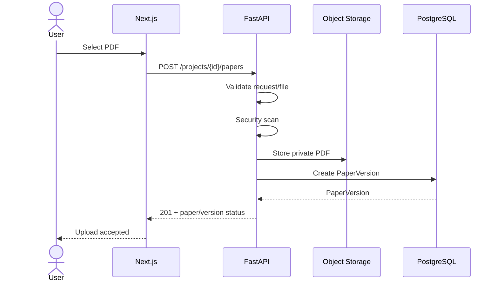
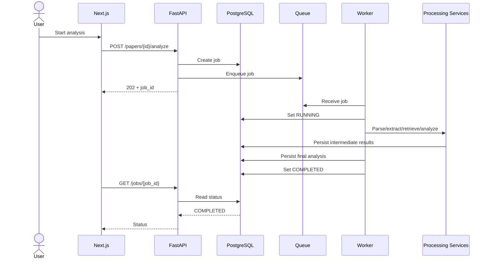
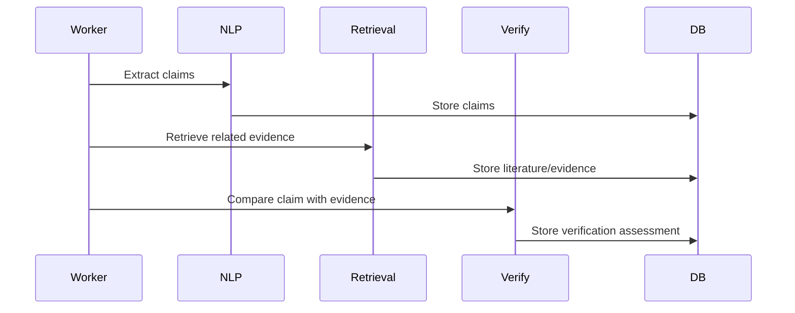
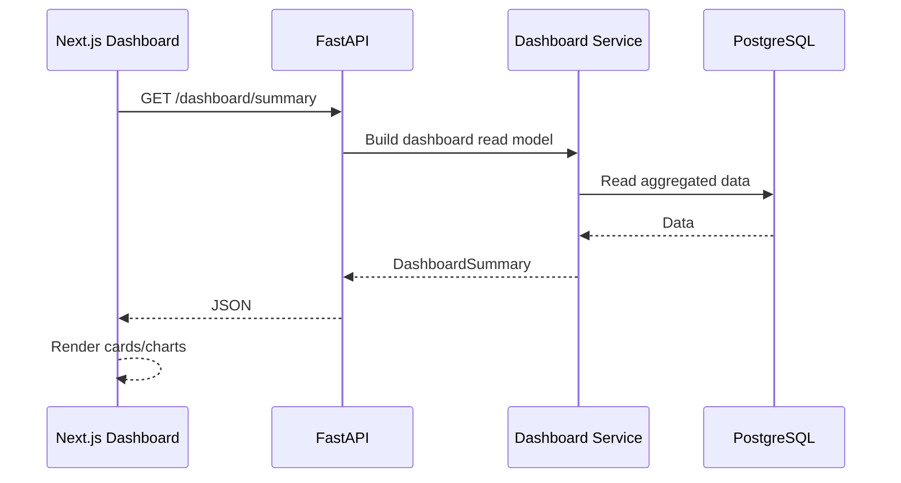
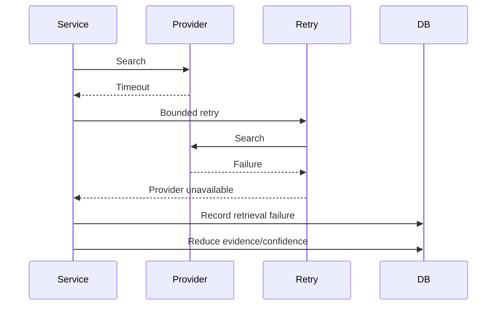

# Genesis-AI — Phase 3 System Architecture

## Document Status

- Project: Genesis-AI Research Intelligence Platform
- Blueprint Phase: 3 — System Architecture
- Status: Revised draft for review
- Source of truth: `docs/phase-0-blueprint.pdf`
- Requirements baseline: `docs/requirements/phase-2-requirements.md`
- Previous checkpoint: Phase 2 requirements commit `7c42ea9`
- Architecture philosophy: modular, evidence-grounded, deployable, observable, and deliberately simple

---

# 1. Purpose

This document converts the approved Phase 2 requirements into a concrete
technical architecture that can guide implementation.

The architecture supports the Genesis-AI workflow:

Research Paper
→ Document Processing
→ Research Information Extraction
→ Scholarly Retrieval
→ Evidence Retrieval
→ Claim/Citation Verification
→ Novelty & Research-Gap Analysis
→ Quality Evaluation
→ Recommendations
→ Researcher Decision Support

Genesis-AI remains a research decision-support system. It does not claim
to determine scientific truth, absolute novelty, publication acceptance,
plagiarism, or research validity.

---

# 2. Architecture Principles

## P1 — Evidence before conclusion

Important conclusions must be based on available evidence.

```text
Source
  ↓
Retrieval
  ↓
Evidence
  ↓
Analysis
  ↓
Conclusion
```

## P2 — Separation of concerns

The system is divided into explicit layers:

```text
Client
  ↓
API
  ↓
Application
  ↓
Domain/Capability Services
  ↓
ML / Retrieval
  ↓
Data
  ↓
Infrastructure
  ↓
Observability
```

## P3 — Asynchronous expensive work

Document parsing, OCR, extraction, retrieval, verification, evaluation,
and recommendation generation are background operations.

## P4 — Traceability

Important assessments expose:

- score
- evidence
- reasoning
- sources
- confidence
- limitations

## P5 — Graceful degradation

Provider failure, weak retrieval, incomplete extraction, or insufficient
evidence must reduce capability/confidence rather than cause fabricated
results.

## P6 — Provider abstraction

External scholarly and model providers are accessed through internal
interfaces/adapters.

## P7 — MVP simplicity

The MVP does not introduce:

- Kubernetes
- microservice-per-feature deployment
- dedicated vector database
- unnecessary multiple databases
- custom foundation-model training

## P8 — Untrusted documents

Uploaded papers and extracted document text are untrusted data. Document
content must never override trusted system instructions.

## P9 — Deployment-aware design

The architecture supports deployment from the beginning while scaling
only when demonstrated need justifies it.

---

# 3. System Context

```text
                         RESEARCHER
                             |
                             v
                  +----------------------+
                  | Next.js Web Client   |
                  +----------+-----------+
                             |
                           HTTPS
                             |
                             v
                  +----------------------+
                  | FastAPI API          |
                  | Auth / Validation    |
                  | Authorization        |
                  | Orchestration        |
                  +----------+-----------+
                             |
             +---------------+----------------+
             |               |                |
             v               v                v
       PostgreSQL       Object Storage      Queue
       + pgvector                            |
                                             v
                                      Background Worker
                                             |
                          +------------------+------------------+
                          |          |          |              |
                          v          v          v              v
                    Document/NLP Retrieval Verification   Evaluation
                          |          |          |              |
                          +----------+----------+--------------+
                                             |
                                             v
                                         ML / LLM
                                             |
                                             v
                                    External Providers
```

---

# 4. Component Architecture

## 4.1 Next.js Web Application

Responsibilities:

- authentication interface
- project workspace
- paper upload
- job status
- analysis report
- evidence exploration
- research discovery
- research landscape
- research gaps
- research positioning
- recommendations
- dashboard

The frontend does not directly access the database or perform authoritative
research analysis.

### Dashboard architecture

The dashboard is a research-workflow surface, not a decorative analytics
page.

It should eventually expose backend-backed data such as:

```text
Research Overview
├── Active projects
├── Papers analyzed
├── Claims analyzed
├── Citations checked
├── Evaluation/quality overview
│
├── Analysis trends
├── Research areas
├── Claim/evidence status
├── Citation status
│
├── Recent projects
├── Recent papers
│
├── Research gaps
├── Novelty / positioning
└── Recommendations
```

The visual direction is:

- minimal
- professional
- research-oriented
- information-dense but readable
- creative without becoming cartoonish

No dashboard metric should be presented as real unless it is backed by
actual application data.

---

## 4.2 FastAPI API

Responsibilities:

- HTTP routing
- authentication
- authorization
- request validation
- response serialization
- API versioning
- resource access control
- job creation
- status retrieval
- report retrieval

Base path:

```text
/api/v1
```

The API does not contain model algorithms or large processing workflows.

---

## 4.3 Application Services

Application services coordinate workflows.

Examples:

```text
ProjectApplicationService
PaperApplicationService
AnalysisApplicationService
LiteratureApplicationService
DashboardApplicationService
```

They coordinate capability services and persistence but do not duplicate
domain algorithms.

---

## 4.4 Capability Services

Repository capability boundaries:

```text
services/
├── document-processing/
├── retrieval/
├── nlp/
├── citation-analysis/
├── claim-verification/
├── novelty-analysis/
├── evaluation/
└── recommendation/
```

These are modular Python packages in the MVP, not independently deployed
microservices.

### document-processing

Owns:

- PDF validation integration
- parsing
- OCR fallback
- structure detection
- document chunks
- extraction metadata

### nlp

Owns:

- research information extraction
- claim extraction
- method/dataset/result extraction
- NLP preprocessing

### retrieval

Owns:

- provider adapters
- literature discovery
- candidate retrieval
- evidence retrieval
- retrieval provenance

### citation-analysis

Owns:

- citation occurrence processing
- citation context
- cited-work matching
- citation relevance signals

### claim-verification

Owns:

- claim/evidence comparison
- support status
- contradiction signals
- insufficient-evidence determination

### novelty-analysis

Owns:

- similarity signals
- prior-work comparison
- relative novelty signals
- candidate research-gap signals

### evaluation

Owns:

- evaluation dimensions
- score aggregation
- confidence computation
- assessment construction

### recommendation

Owns:

- recommendation generation
- prioritization
- evidence linkage
- limitation reporting

---

# 5. ML Architecture

```text
ml/
├── models/
├── training/
├── inference/
├── evaluation/
└── experiments/
```

Responsibilities:

- model definitions
- model loading
- inference
- embeddings
- ML preprocessing/postprocessing
- training experiments where justified
- ML evaluation

Initial model direction remains compatible with:

- PyTorch
- Transformers
- sentence-transformers

Model-specific code must not leak into FastAPI routes.

---

# 6. Retrieval Architecture

Retrieval uses an internal abstraction.

```text
                 Retrieval Interface
                         |
       +-----------------+------------------+
       |                 |                  |
    OpenAlex       Semantic Scholar       Crossref
       |                 |                  |
       +-----------------+------------------+
                         |
                       arXiv
```

## 6.1 Normalized provider contract

Conceptual interface:

```python
search(query, filters)
get_work(identifier)
get_citations(identifier)
get_references(identifier)
get_full_text_or_link(identifier)
```

Provider adapters normalize:

```text
provider
provider_id
title
authors
abstract
publication_date
venue
doi / identifier
links
availability
citation_metadata
```

The internal retrieval layer must not expose provider-specific response
structures to the rest of the application.

## 6.2 Retrieval run

Every retrieval operation should be associated with a retrieval run:

```text
RetrievalRun
├── id
├── project_id / analysis_id
├── query
├── filters
├── providers_used
├── started_at
├── completed_at
├── status
└── error information
```

This permits later reproducibility and provenance analysis.

---

# 7. Evidence Architecture

Evidence is a first-class domain object.

```text
Evidence
├── id
├── source_type
├── source_identifier
├── literature_item_id
├── paper_version_id
├── location
├── text_span
├── retrieval_run_id
├── relevance_score
├── extraction_confidence
└── created_at
```

An assessment references evidence rather than embedding unsupported claims
inside free-form generated text.

```text
Assessment
├── dimension
├── score
├── reasoning
├── confidence
├── limitations[]
└── evidence[]
```

Evidence provenance must survive from retrieval through final report
generation.

---

# 8. Database Architecture

Primary database:

```text
PostgreSQL
```

Vector extension:

```text
pgvector
```

Object storage:

```text
Private object/file storage
```

## 8.1 Core relational model

```text
users
  1
  |
  N
projects
  1
  |
  +--------------------+
  |                    |
  N                    N
papers             literature_items
  |
  N
paper_versions
  |
  +------------------+
  |                  |
  N                  N
claims            citations

paper_versions
  |
  N
processing_jobs

paper_versions
  |
  N
analyses
  |
  N
assessments
  |
  N
assessment_evidence
  |
  N
evidence

analyses
  |
  N
recommendations

retrieval_runs
  |
  N
evidence
```

## 8.2 Entity requirements

### users

Primary key:

```text
id
```

Stores identity and account metadata.

### projects

Primary key:

```text
id
```

Foreign key:

```text
owner_user_id → users.id
```

Important indexes:

```text
(owner_user_id)
```

### papers

Primary key:

```text
id
```

Foreign key:

```text
project_id → projects.id
```

### paper_versions

Primary key:

```text
id
```

Foreign key:

```text
paper_id → papers.id
```

Important fields:

```text
version_number
storage_key
file_hash
file_size
mime_type
processing_status
created_at
```

Recommended uniqueness:

```text
(paper_id, version_number)
```

### processing_jobs

Primary key:

```text
id
```

Foreign key:

```text
paper_version_id → paper_versions.id
```

Important fields:

```text
job_type
status
stage
attempts
error_code
error_message
created_at
started_at
completed_at
```

Important index:

```text
(status, created_at)
```

### literature_items

Primary key:

```text
id
```

Provider identifiers should be unique within provider scope:

```text
(provider, provider_id)
```

### claims

Primary key:

```text
id
```

Foreign key:

```text
paper_version_id → paper_versions.id
```

Stores text/span location and extraction metadata.

### citations

Primary key:

```text
id
```

Foreign keys:

```text
paper_version_id → paper_versions.id
literature_item_id → literature_items.id
```

### analyses

Primary key:

```text
id
```

Foreign key:

```text
paper_version_id → paper_versions.id
```

Important fields:

```text
status
pipeline_version
created_at
started_at
completed_at
```

### assessments

Primary key:

```text
id
```

Foreign key:

```text
analysis_id → analyses.id
```

Important uniqueness:

```text
(analysis_id, dimension)
```

### evidence

Primary key:

```text
id
```

Foreign keys may reference:

```text
literature_items.id
paper_versions.id
retrieval_runs.id
```

### assessment_evidence

Join table:

```text
assessment_id → assessments.id
evidence_id   → evidence.id
```

Uniqueness:

```text
(assessment_id, evidence_id)
```

### recommendations

Primary key:

```text
id
```

Foreign key:

```text
analysis_id → analyses.id
```

### retrieval_runs

Primary key:

```text
id
```

Foreign key:

```text
analysis_id → analyses.id
```

---

# 9. Vector Architecture

pgvector stores embeddings associated with searchable domain objects.

Candidate vector-bearing records:

```text
paper chunks
literature chunks
claims
evidence passages
```

Vectors must retain their source identity.

```text
Embedding
├── source_type
├── source_id
├── model_name
├── model_version
├── vector
└── created_at
```

Changing the embedding model must not silently invalidate old vectors.

---

# 10. Object Storage Architecture

Uploaded papers are stored outside PostgreSQL.

Conceptual key:

```text
users/{user_id}/projects/{project_id}/papers/{paper_id}/versions/{version_id}/original.pdf
```

Derived artifacts may use a separate namespace.

Files are private by default.

The API authorizes access before generating or serving controlled file access.

---

# 11. API Contracts

## 11.1 Standard error envelope

```json
{
  "error": {
    "code": "RESOURCE_NOT_FOUND",
    "message": "Paper was not found.",
    "request_id": "..."
  }
}
```

Every API error should provide a stable machine-readable code.

## 11.2 Project creation

```text
POST /api/v1/projects
```

Request:

```json
{
  "name": "Research Project",
  "description": "Optional description"
}
```

Response:

```json
{
  "id": "...",
  "name": "Research Project",
  "description": "...",
  "created_at": "..."
}
```

Possible statuses:

```text
201 Created
400 Bad Request
401 Unauthorized
422 Validation Error
```

## 11.3 Project retrieval

```text
GET /api/v1/projects/{project_id}
```

Authorization:

- authenticated user
- user must own or have access to project

Possible statuses:

```text
200 OK
401 Unauthorized
403 Forbidden
404 Not Found
```

## 11.4 Paper upload

```text
POST /api/v1/projects/{project_id}/papers
Content-Type: multipart/form-data
```

Input:

```text
file
```

Response:

```json
{
  "paper_id": "...",
  "paper_version_id": "...",
  "status": "VALIDATING"
}
```

Possible statuses:

```text
201 Created
400 Bad Request
401 Unauthorized
403 Forbidden
413 Payload Too Large
415 Unsupported Media Type
422 Validation Error
```

## 11.5 Start analysis

```text
POST /api/v1/papers/{paper_id}/analyze
```

Response:

```json
{
  "job_id": "...",
  "status": "QUEUED"
}
```

Possible statuses:

```text
202 Accepted
400 Bad Request
401 Unauthorized
403 Forbidden
404 Not Found
409 Conflict
```

`409 Conflict` is used when an equivalent active analysis already exists.

## 11.6 Job status

```text
GET /api/v1/jobs/{job_id}
```

Response:

```json
{
  "job_id": "...",
  "status": "RUNNING",
  "stage": "RETRIEVING",
  "attempts": 1,
  "created_at": "...",
  "started_at": "..."
}
```

## 11.7 Analysis report

```text
GET /api/v1/analyses/{analysis_id}
```

Response concept:

```json
{
  "analysis_id": "...",
  "status": "COMPLETED",
  "paper_id": "...",
  "assessments": [],
  "recommendations": [],
  "summary": {}
}
```

## 11.8 Assessment evidence

```text
GET /api/v1/analyses/{analysis_id}/evidence
```

Returns evidence objects with provenance.

## 11.9 Dashboard

```text
GET /api/v1/dashboard/summary
GET /api/v1/dashboard/trends
GET /api/v1/dashboard/recent-projects
GET /api/v1/dashboard/recent-papers
```

These endpoints return backend-generated read models.

---

# 12. Dashboard Read Models

The frontend must not calculate core business analytics from raw database
structures.

Conceptual models:

```text
DashboardSummary
├── active_projects
├── papers_analyzed
├── claims_analyzed
├── citations_checked
├── quality_summary
├── claim_support_summary
├── citation_summary
├── research_gap_summary
├── novelty_summary
└── recommendation_summary
```

```text
DashboardTrend
├── period
├── papers_analyzed
├── claims_analyzed
├── citations_checked
└── average_quality
```

```text
RecentProject
├── id
├── name
├── paper_count
├── last_activity
└── status
```

```text
RecentPaper
├── id
├── title
├── project_id
├── version
├── analysis_status
└── last_analyzed_at
```

---

# 13. Frontend/API Data Flows

## Dashboard

```text
Next.js Dashboard
       |
       | GET /api/v1/dashboard/summary
       v
FastAPI
       |
       v
DashboardApplicationService
       |
       v
Read Model / Repository
       |
       v
PostgreSQL
       |
       v
JSON response
       |
       v
Dashboard components
```

## Paper analysis

```text
Upload UI
   |
   v
POST paper
   |
   v
FastAPI
   |
   +--> store file
   +--> create version
   +--> validate
   |
   v
POST analyze
   |
   v
Job created
   |
   v
Frontend reads job status
   |
   v
Completed analysis
   |
   v
Report UI
```

---

# 14. Asynchronous Job Architecture

## 14.1 Job state machine

```text
QUEUED
  |
  v
VALIDATING
  |
  v
PROCESSING
  |
  v
EXTRACTING
  |
  v
RETRIEVING
  |
  v
ANALYZING
  |
  +-------> FAILED
  |
  v
COMPLETED
```

Partial completion:

```text
Any recoverable stage
        |
        v
     PARTIAL
```

## 14.2 Job contract

```text
Job
├── id
├── job_type
├── paper_version_id
├── status
├── stage
├── attempts
├── created_at
├── started_at
├── completed_at
├── error_code
└── error_message
```

## 14.3 Retry

Retries must be bounded.

Transient failures may retry.

Permanent failures must transition to `FAILED`.

Repeated failures must not produce infinite loops.

## 14.4 Idempotency

Equivalent analysis requests should not create uncontrolled duplicate
processing.

Idempotency may use:

```text
paper_version_id
+
analysis configuration/version
+
active job status
```

Database constraints and server-side checks enforce consistency.

---

# 15. File Lifecycle

```text
UPLOADED
   ↓
VALIDATING
   ↓
SCANNING
   ↓
STORED
   ↓
PROCESSING
   ↓
ANALYZED
```

Failure states must preserve diagnostic information.

Invalid or unsafe files are rejected.

Deletion/retention policy must be implemented consistently when the
account/data-management phase is reached.

---

# 16. Authentication and Authorization

Authentication answers:

```text
Who is the user?
```

Authorization answers:

```text
Can this user access this resource?
```

Every private resource follows:

```text
Request
  ↓
Authenticate
  ↓
Resolve resource
  ↓
Authorize ownership/access
  ↓
Allow or reject
```

Client-side checks are never considered sufficient authorization.

---

# 17. Configuration and Secrets

```text
Environment
   ↓
Configuration Loader
   ↓
Application
```

Secrets include:

- database credentials
- provider API keys
- LLM credentials
- object-storage credentials
- authentication secrets

Secrets must not be committed to Git or exposed in frontend bundles.

Environment-specific values belong in development/test/production
configuration or secret-management facilities.

---

# 18. Database Migration Strategy

Database schema changes are version-controlled.

Requirements:

- migration files committed to Git
- development database can be recreated
- test database can be recreated
- schema changes reviewed with code
- production changes use migrations
- no undocumented manual production schema modifications

The concrete migration library is an implementation decision to be
selected during the relevant implementation phase.

---

# 19. Concurrency and Consistency

The architecture accounts for:

- duplicate uploads
- duplicate analysis requests
- concurrent project updates
- worker retries
- provider retries
- partial pipeline completion

Consistency mechanisms:

```text
database constraints
+
transactions
+
unique keys
+
idempotency checks
+
controlled job states
```

The frontend must not be the authority for consistency.

---

# 20. Security Boundaries

## Document security

```text
Upload
  ↓
Validation
  ↓
Malware/security scanning
  ↓
Sandboxed parsing
  ↓
Extracted data
  ↓
Pipeline
```

## Prompt-injection isolation

Paper text is data.

Trusted instructions remain outside the document content.

Conceptually:

```text
Trusted system instructions
          +
Structured document content
          ↓
        Model
```

Document content cannot redefine system policy or tool permissions.

## API security

Architecture supports:

- HTTPS
- authentication
- authorization
- rate limiting
- request validation
- bounded uploads
- safe error messages

---

# 21. External Provider Failure Model

```text
Application
    |
    v
Provider Adapter
    |
    +---- success ----> normalized result
    |
    +---- timeout ----> bounded retry
    |
    +---- failure ----> alternate/cached source where possible
                              |
                              v
                         limitation
                              |
                              v
                         lower confidence
```

The system must never replace unavailable evidence with invented evidence.

---

# 22. Sequence Diagrams

## 22.1 Paper upload



## 22.2 Analysis processing



## 22.3 Evidence/claim flow



## 22.4 Dashboard



## 22.5 Retrieval failure



---

# 23. Service Contracts

Capability services communicate through typed domain objects rather than
raw provider responses.

Examples:

```text
ParsedDocument
ExtractedResearchInfo
LiteratureCandidate
EvidenceItem
ClaimAssessment
CitationAssessment
NoveltySignal
EvaluationAssessment
Recommendation
```

Each service should:

1. receive validated structured input
2. perform its responsibility
3. return structured output
4. preserve provenance
5. report failure explicitly

Services must not silently convert failure into empty successful results.

---

# 24. Error Taxonomy

Stable error categories include:

```text
VALIDATION_ERROR
UNSUPPORTED_FILE
FILE_TOO_LARGE
FILE_SECURITY_REJECTED
RESOURCE_NOT_FOUND
FORBIDDEN
DUPLICATE_OPERATION
PROCESSING_FAILED
PROVIDER_UNAVAILABLE
RETRIEVAL_INSUFFICIENT
EXTRACTION_FAILED
ANALYSIS_INCOMPLETE
INTERNAL_ERROR
```

Internal stack traces and secrets must not be returned to clients.

---

# 25. Observability

Every request/job should carry correlation information.

Minimum fields:

```text
request_id
job_id
project_id
paper_id
paper_version_id
stage
status
duration
provider
model/version where applicable
error_code
```

Logs must not contain:

- API keys
- access tokens
- full private documents
- unnecessary sensitive data

Observability should measure both:

```text
software health
+
analysis quality
```

---

# 26. Testing Architecture

```text
Unit Tests
    ↓
Service Tests
    ↓
API Contract Tests
    ↓
Pipeline Integration Tests
    ↓
End-to-End Tests
    ↓
Evaluation Benchmark
```

Important regression fixtures include:

- representative PDFs
- scanned PDFs
- malformed PDFs
- papers with citations
- papers with weak evidence
- provider failure cases
- incomplete extraction cases

Model/prompt changes should eventually run evaluation tests before
deployment.

---

# 27. Deployment Architecture

Initial production topology:

```text
                         Internet
                            |
              +-------------+-------------+
              |                           |
              v                           v
        Next.js Web                    FastAPI
                                          |
                   +----------------------+----------------+
                   |                      |                |
                   v                      v                v
             PostgreSQL             Object Storage       Queue
             + pgvector                                   |
                                                         v
                                                       Worker
                                                         |
                                              +----------+----------+
                                              |                     |
                                           ML/NLP              Retrieval
                                              |
                                              v
                                           Providers
```

Initial environments:

```text
Development
Testing
Production
```

Each environment has separate configuration and secrets.

The MVP can begin as a modest deployment and scale later.

---

# 28. Scaling Path

```text
Stage 1
Single deployable environment
        ↓
Stage 2
Dockerized web/API/worker
        ↓
Stage 3
Independent worker scaling
        ↓
Stage 4
Caching / distributed processing if required
```

Scaling decisions must be driven by measured bottlenecks.

---

# 29. Dependency Rules

Allowed dependency direction:

```text
Web
 ↓
API
 ↓
Application
 ↓
Capability Services
 ↓
ML / Retrieval / Data abstractions
```

Rules:

1. Domain services cannot depend on Next.js.
2. ML code cannot depend on HTTP request objects.
3. API routes cannot contain model algorithms.
4. Provider-specific code remains behind adapters.
5. UI consumes API contracts, not database tables.
6. Database access is not scattered through UI/model code.
7. Evidence/provenance remains available throughout analysis.
8. Circular dependencies are prohibited.

---

# 30. Blueprint Alignment

This architecture preserves the blueprint technology direction:

- Next.js / React
- FastAPI
- Python services
- PyTorch / Transformers
- sentence-transformers
- PyMuPDF
- GROBID
- OCR fallback
- PostgreSQL
- pgvector
- object storage
- scholarly APIs
- LLM API
- Docker
- GitHub Actions / CI
- background workers / queue
- logging / monitoring

It deliberately preserves the blueprint's MVP exclusions:

- no Kubernetes
- no dedicated vector database
- no microservice-per-feature deployment
- no custom foundation-model training
- no unnecessary multiple databases

---

# 31. Phase 3 Definition of Done

## Architecture

- [x] Architecture principles
- [x] System boundaries
- [x] Layer responsibilities
- [x] Component architecture
- [x] Repository/service boundaries
- [x] Dependency rules

## Data

- [x] Core entities
- [x] Relationships
- [x] Keys
- [x] Important constraints
- [x] Important indexes
- [x] pgvector architecture
- [x] Object storage architecture
- [x] Migration strategy

## API

- [x] API versioning
- [x] Core endpoints
- [x] Request/response contracts
- [x] Error envelope
- [x] Authorization rules
- [x] Dashboard read models

## Processing

- [x] Synchronous/asynchronous boundary
- [x] Job state machine
- [x] Retry behavior
- [x] Idempotency
- [x] Failure handling
- [x] File lifecycle
- [x] Processing sequence

## Research intelligence

- [x] Retrieval abstraction
- [x] Provider normalization
- [x] Retrieval provenance
- [x] Evidence model
- [x] Claim/evidence flow
- [x] Assessment model
- [x] Confidence/limitations
- [x] Dashboard data architecture
- [x] Research Discovery extension

## Security

- [x] Authentication boundary
- [x] Authorization boundary
- [x] File security
- [x] Prompt-injection isolation
- [x] Secrets/configuration
- [x] Provider failure isolation

## Deployment & quality

- [x] Deployment topology
- [x] Environment separation
- [x] Scaling path
- [x] Testing architecture
- [x] Observability architecture
- [x] Blueprint compliance

## Final completion gates

- [ ] Project-owner review
- [ ] Any requested corrections applied
- [ ] Final Git commit
- [ ] Working tree clean

---

# 32. Phase 3 Sign-Off

Status: PENDING PROJECT OWNER APPROVAL

Project Owner: ____________________

Date: ____________________

Approval:

[ ] Approved

[ ] Changes requested

Phase 3 is considered complete only after approval and the final architecture
document is committed to Git.
